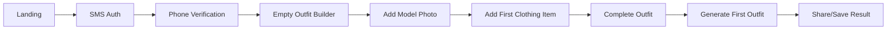
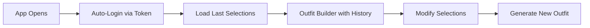
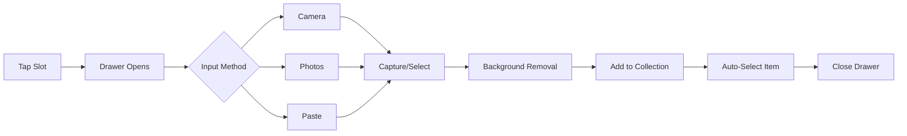

# UX Design Document: Angie-Tryon

## 1. Design Philosophy

### Core Principles
1. **Mobile-First**: Every interaction optimized for touch and thumb reach
2. **Minimal Friction**: No unnecessary steps between idea and generation
3. **Visual Clarity**: Show the user what they're building at all times
4. **Forgiving**: Easy to undo, retry, and experiment
5. **Instant Feedback**: Every action has immediate visual response

### Design System
- **Framework**: Shadcn/ui components
- **Color Scheme**: Neutral palette with green accent (from mockups)
- **Typography**: System fonts for performance
- **Spacing**: 8px grid system
- **Animations**: Subtle, < 300ms transitions

## 2. Information Architecture

```
App Root (/)
├── Main View (Outfit Builder)
│   ├── Pre-Generation State
│   │   ├── Outfit Slots
│   │   └── Generate Button
│   ├── Post-Generation State
│   │   ├── Result Display
│   │   └── Action Buttons
│   └── Selection Drawer
│       ├── Input Methods
│       ├── Item Grid
│       └── Collection Management
```

## 3. User Flows

### 3.1 First-Time User Flow


### 3.2 Returning User Flow


### 3.3 Item Addition Flow


## 4. Screen Specifications

### 4.1 Main Screen - Pre-Generation State

**Layout Structure:**
```
┌─────────────────────────────┐
│       AIStylist      [⋮]     │ <- Header
├─────────────────────────────┤
│                             │
│     Outfit Slots            │
│   ┌───────────────────┐     │
│   │ 👤 Model          │     │ <- Selected indicator
│   └───────────────────┘     │
│   ┌───────────────────┐     │
│   │ 👔 Inside Top     │     │ <- Selected indicator
│   └───────────────────┘     │
│   ┌───────────────────┐     │
│   │ ➕ Outside Top    │     │ <- Empty state
│   └───────────────────┘     │
│   ┌───────────────────┐     │
│   │ 👖 Bottoms        │     │ <- Selected indicator
│   └───────────────────┘     │
│   ┌───────────────────┐     │
│   │ 👟 Shoes          │     │ <- Selected indicator
│   └───────────────────┘     │
│                             │
│   [✨ Generate Outfit]      │ <- Primary CTA
│                             │
│   ⓘ AI results take 15-30s  │ <- Expectation setting
└─────────────────────────────┘
```

**Component Details:**

1. **Header**
   - Title: "AIStylist" (center)
   - Menu: Three dots (right)
   - Height: 56px
   - Background: Light beige (#F5F2ED)

2. **Outfit Slots Section**
   - Title: "Outfit Slots" (24px, bold)
   - Subtitle: "Select items to visualize" (14px, gray)
   - Reset button: "RESET ALL" (right-aligned, purple text)

3. **Slot Cards**
   - Height: 80px
   - Border radius: 12px
   - Background: White
   - Shadow: Subtle elevation
   - Padding: 16px

   **Slot States:**
   - **Empty**: Dashed icon, "Add an item" text, green (+) button
   - **Filled**: Item thumbnail, item name, edit icon

4. **Generate Button**
   - Height: 56px
   - Border radius: 28px
   - Background: Green gradient (#7FA67A)
   - Icon: Sparkles
   - Text: "Generate Outfit"
   - Subtitle: "CREATE YOUR AI VISUALIZATION"
   - Disabled when insufficient slots filled

### 4.2 Main Screen - Post-Generation State

**Layout Structure:**
```
┌─────────────────────────────┐
│   [<] AIStylist      [⋮]    │ <- Back navigation
├─────────────────────────────┤
│                             │
│   ┌───────────────────┐     │
│   │                   │     │
│   │                   │     │
│   │   Generated       │     │ <- Full outfit image
│   │    Outfit         │     │
│   │                   │     │
│   │                   │     │
│   └───────────────────┘     │
│                             │
│   ┌─────────┬─────────┐     │
│   │  Share  │Download │     │ <- Action buttons
│   └─────────┴─────────┘     │
│                             │
│   [🔄 Regenerate]           │ <- Secondary action
│                             │
│   [View Outfit Details]     │ <- Tertiary action
└─────────────────────────────┘
```

### 4.3 Selection Drawer (Bottom Sheet)

**Layout Structure:**
```
┌─────────────────────────────┐
│ Select [Slot Type]    [X]   │ <- Drawer header
├─────────────────────────────┤
│ ┌─────┬─────┬─────┬─────┐  │
│ │ 📷  │ 🖼️  │ 📋  │ ➕  │  │ <- Input methods
│ │Cam  │Photo│Paste│ URL │  │
│ └─────┴─────┴─────┴─────┘  │
├─────────────────────────────┤
│ Your [Category]   [See All] │ <- Section header
├─────────────────────────────┤
│ ┌────┐ ┌────┐ ┌────┐       │
│ │    │ │    │ │    │       │ <- Item grid
│ │ 👔 │ │ 👕 │ │ 🧥 │       │
│ └────┘ └────┘ └────┘       │
│ ┌────┐ ┌────┐ ┌────┐       │
│ │    │ │    │ │ ➕ │       │
│ │ 👗 │ │ 🎽 │ │Add │       │
│ └────┘ └────┘ └────┘       │
└─────────────────────────────┘
```

**Interaction Details:**

1. **Drawer Behavior**
   - Slides up from bottom on mobile
   - Modal overlay on desktop
   - Swipe down to dismiss
   - Tap outside to close

2. **Input Methods Bar**
   - Camera: Opens device camera
   - Photos: Opens photo picker
   - Paste: Focuses text input
   - URL: Opens URL input dialog

3. **Item Grid**
   - 3 columns on mobile
   - 4-6 columns on tablet/desktop
   - Square aspect ratio
   - Tap to select and close
   - Long press for options

## 5. Component Specifications

### 5.1 Outfit Slot Component

```typescript
interface OutfitSlotProps {
  label: string;           // "Model", "Inside Top", etc.
  value?: Generation;      // Selected item
  onSelect: () => void;   // Opens drawer
  onEdit?: () => void;    // Edit existing selection
  onClear?: () => void;   // Remove selection
  required?: boolean;     // Shows required indicator
}
```

**Visual States:**
- **Empty**: Dashed border, muted icon, "Add an item" text
- **Loading**: Skeleton animation
- **Selected**: Solid border, item thumbnail, edit icon
- **Error**: Red border, error message

### 5.2 Selection Drawer Component

```typescript
interface SelectionDrawerProps {
  isOpen: boolean;
  slot: SlotType;
  items: Generation[];
  onSelect: (item: Generation) => void;
  onAdd: (method: InputMethod) => void;
  onClose: () => void;
}
```

**Features:**
- Lazy loading for large collections
- Search/filter capability (v2)
- Multi-select mode (v2)
- Batch operations (v2)

### 5.3 Generate Button Component

```typescript
interface GenerateButtonProps {
  isEnabled: boolean;
  isGenerating: boolean;
  onClick: () => void;
  estimatedTime?: string;
}
```

**Visual States:**
- **Disabled**: Gray background, no interaction
- **Enabled**: Green gradient, hover effect
- **Generating**: Loading spinner, progress text
- **Error**: Red background, retry option

## 6. Interaction Patterns

### 6.1 Touch Gestures
- **Tap**: Primary selection action
- **Long Press**: Context menu (future)
- **Swipe Down**: Dismiss drawer
- **Pinch**: Zoom generated image
- **Pull to Refresh**: Reload wardrobe

### 6.2 Animations
- **Drawer Slide**: 300ms ease-out
- **Card Selection**: 150ms scale + shadow
- **Loading States**: Skeleton pulse
- **Generation Progress**: Smooth progress bar
- **Success Feedback**: Brief checkmark animation

### 6.3 Feedback Mechanisms
- **Visual**: Color changes, shadows, borders
- **Haptic**: Subtle vibration on selection (iOS)
- **Audio**: Optional sound effects (v2)
- **Text**: Clear status messages

## 7. Responsive Breakpoints

### Mobile (320px - 768px)
- Single column layout
- Full-screen drawer
- Bottom navigation
- 3-column item grid
- Stacked action buttons

### Tablet (768px - 1024px)
- Two-column layout option
- Modal drawer (centered)
- Side navigation option
- 4-column item grid
- Inline action buttons

### Desktop (1024px+)
- Multi-panel layout
- Side panel for selections
- Persistent navigation
- 6-column item grid
- Hover interactions enabled

## 8. Accessibility Specifications

### 8.1 ARIA Labels
```html
<button aria-label="Select model photo">
  <span aria-hidden="true">👤</span>
  <span>Model</span>
</button>
```

### 8.2 Keyboard Navigation
- **Tab**: Navigate between slots
- **Enter/Space**: Activate selection
- **Escape**: Close drawer
- **Arrow Keys**: Navigate grid

### 8.3 Screen Reader Support
- Meaningful alt text for all images
- Status announcements for generation
- Error messages read immediately
- Progress updates announced

## 9. Error States & Edge Cases

### 9.1 Error Scenarios
- **No Internet**: Show offline message, disable generation
- **Upload Failed**: Retry option, clear error message
- **Generation Failed**: Specific error, retry button
- **Auth Expired**: Seamless re-authentication
- **Storage Full**: Clear cache option

### 9.2 Empty States
- **No Model**: "Add a photo of yourself to get started"
- **No Clothes**: "Start building your wardrobe"
- **No Results**: "No items match your search"

### 9.3 Loading States
- **Initial Load**: App skeleton
- **Generation**: Progress indicator with time estimate
- **Upload**: Progress bar with cancel option
- **Background Removal**: Processing indicator

## 10. Mockup Analysis

### 10.1 Before First Generation
**File**: `before-first-generation.png`

**Key Observations:**
- Clean, card-based layout
- Clear visual hierarchy
- Prominent CTA button
- Helpful time expectation
- Edit affordances on filled slots

**Implementation Notes:**
- Use Shadcn Card components
- Implement custom slot component
- Add subtle animations on interaction
- Ensure thumb-reachable CTA

### 10.2 After First Generation
**File**: `after-first-generation.png`

**Key Observations:**
- Focus shifts to generated image
- Clear action buttons (Share, Download)
- Regenerate option available
- Back navigation to edit outfit

**Implementation Notes:**
- Full-screen image display
- Native share API integration
- Download with proper filename
- Smooth transition from generation

### 10.3 Selection Sheet
**File**: `outfit-component-selection-sheet.png`

**Key Observations:**
- Clear input method options
- Grid layout for items
- "See All" for browsing
- Visual distinction between items

**Implementation Notes:**
- Use Shadcn Drawer component
- Implement virtual scrolling for performance
- Add image lazy loading
- Support drag-to-reorder (v2)

## 11. Performance Considerations

### 11.1 Image Optimization
- WebP format with fallbacks
- Responsive image sizes
- Lazy loading for off-screen items
- Progressive loading for large images
- Thumbnail generation for grid views

### 11.2 State Management
- Local storage for persistence
- Optimistic UI updates
- Debounced API calls
- Cached wardrobe items
- Incremental data fetching

### 11.3 Mobile Optimizations
- Touch event optimization
- Reduced motion option
- Battery-aware processing
- Network-aware quality selection
- Offline queue for uploads

## 12. Brand & Visual Identity

### 12.1 Color Palette
```css
:root {
  --background: #F5F2ED;      /* Light beige */
  --surface: #FFFFFF;         /* White */
  --primary: #7FA67A;         /* Sage green */
  --secondary: #9B8FCC;       /* Soft purple */
  --text-primary: #2C2C2C;   /* Dark gray */
  --text-secondary: #8B8680;  /* Medium gray */
  --border: #E5E2DD;          /* Light gray */
}
```

### 12.2 Typography
```css
.heading-1 {
  font-size: 24px;
  font-weight: 600;
  color: var(--text-primary);
}

.body {
  font-size: 16px;
  font-weight: 400;
  color: var(--text-primary);
}

.caption {
  font-size: 14px;
  font-weight: 400;
  color: var(--text-secondary);
}
```

### 12.3 Iconography
- Use consistent icon library (Lucide)
- 24px standard size
- 2px stroke width
- Matching color scheme

## 13. Future UX Enhancements

### Version 2.0
- Outfit history timeline
- Favorite combinations
- Quick swap variations
- Batch selection mode
- Advanced filters
- Social features

### Version 3.0
- AI style suggestions
- Outfit scheduling
- Weather integration
- Color coordination
- Size recommendations
- Virtual closet organization

## Appendix A: Component Library Mapping

| Component | Shadcn Component | Customization |
|-----------|------------------|---------------|
| Outfit Slot | Card | Custom interior |
| Selection Drawer | Drawer | Custom header |
| Generate Button | Button | Gradient background |
| Item Grid | Grid + Card | Lazy loading |
| Input Methods | Button Group | Icon buttons |
| Progress | Progress | Custom styling |

## Appendix B: Animation Specifications

```css
/* Drawer animation */
.drawer-enter {
  transform: translateY(100%);
}
.drawer-enter-active {
  transform: translateY(0);
  transition: transform 300ms ease-out;
}

/* Card selection */
.card-selected {
  transform: scale(0.98);
  box-shadow: 0 2px 8px rgba(0,0,0,0.1);
  transition: all 150ms ease;
}

/* Generation pulse */
@keyframes pulse {
  0%, 100% { opacity: 1; }
  50% { opacity: 0.5; }
}
```

## Appendix C: Gesture Reference

| Gesture | Action | Context |
|---------|--------|---------|
| Tap | Select | All interactive elements |
| Swipe Down | Dismiss | Drawer only |
| Swipe Left/Right | Navigate | Generated images (v2) |
| Pinch | Zoom | Generated image |
| Long Press | Options | Grid items (v2) |
| Pull Down | Refresh | Main screen |